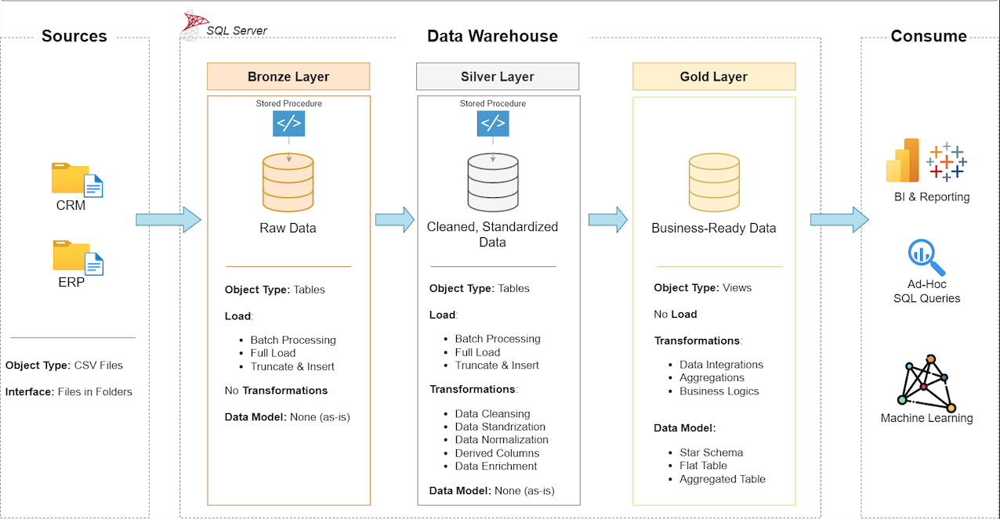
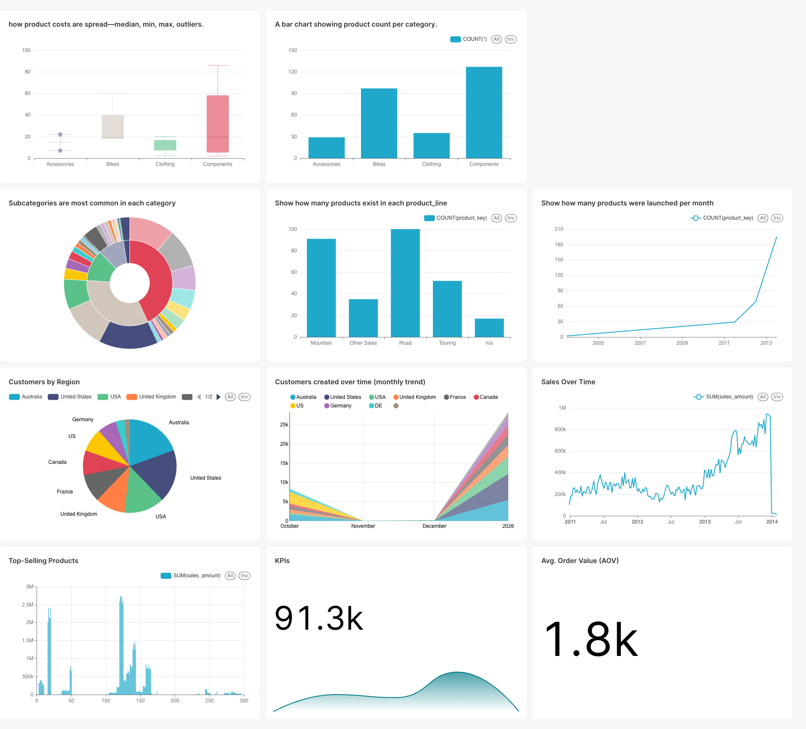

# 💾 Data Warehouse and Analytics Project

This project demonstrates a **complete data warehousing and analytics pipeline**, from ingestion to orchestration to dashboarding. Built using industry-grade tools like **SQL Server**, **Airflow**, **Docker**, and **Superset**, this serves as a full-fledged **portfolio project** for modern data engineering.

---

## 🧱 Data Architecture: Medallion Model



Follows the **Medallion Architecture**:
- **Bronze**: Raw source data (CRM & ERP) ingested from `.csv` files.
- **Silver**: Cleaned and normalized staging data using stored procedures.
- **Gold**: Final business-ready tables exposed as **SQL Server views** following a **star schema** (dimensions & fact).

---

## 🚀 Technologies Used

| Area              | Tool / Tech                          |
|-------------------|---------------------------------------|
| **ETL & Orchestration** | Apache Airflow (`2.8.1`) with DAGs |
| **Database**       | SQL Server 2019 (`dockerized`)       |
| **Dashboarding**   | Apache Superset                      |
| **Containerization**| Docker + Docker Compose             |
| **Development**    | Azure Data Studio + VS Code          |
| **Version Control**| Git + GitHub                         |

---

## 📈 Pipeline Flow (Automated via Airflow DAG)

```
CSV Files (mounted in /data) 
        ↓
[bronze.load_bronze]  - Bulk insert into raw tables
        ↓
[silver.load_silver]  - Data cleansing, joins, transformations
        ↓
Gold Layer Views      - Star schema (dim_ and fact_ views)
        ↓
Apache Superset       - Visualizations & dashboards
```

All orchestrated using an [Airflow DAG](./airflow/dags/load_layers_dag.py), with tasks like:

- `load_bronze_layer`
- `load_silver_layer`
- `gold_layer_info` (note: Gold layer uses pre-built views)

---

## 🐳 Dockerized Infrastructure

Spin up the **entire stack** using Docker Compose:
```bash
docker-compose up -d
```

Services included:
- `sqlserverexpress`: SQL Server 2019 with mounted CSVs
- `airflow-webserver`, `scheduler`, `postgres`: Orchestrate ETL jobs
- `superset`: Business dashboards (port `8088`)

> ✅ Supports Apple M1/M2 (`arm64`) via Docker’s `linux/amd64` emulation

---

## 📂 Repository Structure

```
sql-data-warehouse-project/
│
├── datasets/                     # Raw source CSVs
├── docs/                         # Architecture diagrams, catalog, flow
├── scripts/
│   ├── bronze/                   # BULK INSERT procs
│   ├── silver/                   # Transformations & cleansing logic
│   ├── gold/                     # SQL Server views (dim_*, fact_*)
│
├── airflow/                      # Docker Compose stack + configs
│   ├── docker-compose.yml
│   ├── dag/
│
├── tests/                              # Test scripts and quality files
├── Superset Dashboards and Charts/                     # Dashboards & Charts
├── .gitignore
└── README.md                     # 📍 You're here
```

---

## 📊 Dashboards in Apache Superset

Created clean, slice-driven dashboards that connect directly to the **Gold Layer** via SQL Server connection:



- ✅ Fact-based metrics: Sales, Revenue, Quantity
- ✅ Drill-down dimensions: Products, Customers, Time

Superset runs at: [http://localhost:8088](http://localhost:8088)  
> Default admin: `admin` / `admin` (or as configured)

---

## 🧪 Testing & Validation

- ✔️ Row counts validated during layer transitions
- ✔️ Gold views verified in Azure Data Studio
- ✔️ DAG runs verified in Airflow UI with successful state tracking

---

## 🛡️ License

This project is licensed under the [MIT License](LICENSE). You are free to use, modify, and share this project with proper attribution.

---

## 🙌 What’s Next?

You can extend this project by:

- 📤 Deploying to cloud (e.g., Azure VM, AWS EC2)
- 🧪 Adding automated tests via Great Expectations or dbt
- 📦 Integrating CI/CD for Airflow/Superset releases
